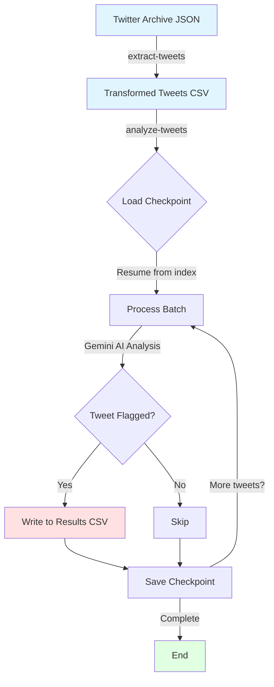

# Tweet Audit | Go Implementation

This is the Go implementation of the Tweet Audit tool, which evaluates tweets against predetermined alignment criteria and generates a list of tweet URLs marked for manual deletion.

## How It Works

The tool works in two stages:

1. **Extract**: Parse your Twitter archive JSON and convert tweets to CSV
2. **Analyze**: Run tweets through Gemini AI in batches, flag problematic ones, save progress

The analyze command processes tweets in batches (default: 10), saves a checkpoint after each batch, and exits. Run it multiple times (or schedule via cron) to work through large archives incrementally.



## Prerequisites

- Go 1.25 or higher
- [golangci-lint](https://golangci-lint.run/) (for linting)
- Google Gemini API key

## Installation

### Install Go

Download and install Go from [go.dev/dl](https://go.dev/dl/)

### Install golangci-lint

```bash
# macOS
brew install golangci-lint

# Linux/macOS/Windows
go install github.com/golangci/golangci-lint/cmd/golangci-lint@latest

# Or see: https://golangci-lint.run/welcome/install/
```

### Clone and Setup

```bash
git clone https://github.com/benx421/tweet-audit.git
cd tweet-audit/go
go mod download
```

## Configuration

### Environment Variables

```bash
export GEMINI_API_KEY="your-api-key-here"
export X_USERNAME="your_twitter_handle"      # Default: Benn_X1
export GEMINI_MODEL="gemini-2.5-flash"       # Default: gemini-2.5-flash
```

### Criteria Configuration

Create a `config.json` file to define what tweets should be flagged:

```json
{
  "criteria": {
    "forbidden_words": ["crypto", "NFT"],
    "topics_to_exclude": [
      "Profanity or unprofessional language",
      "Personal attacks or insults",
      "Outdated political opinions"
    ],
    "tone_requirements": [
      "Professional language only",
      "Respectful communication"
    ],
    "additional_instructions": "Flag any content that could harm professional reputation"
  }
}
```

If you don't provide a config file, the tool uses sensible defaults focused on professional reputation.

## Usage

### Build

```bash
# Build the binary
go build -o bin/tweet-audit ./cmd/tweet-audit
```

### Extract Tweets from Archive

```bash
# Place your Twitter archive at data/tweets/tweets.json
./bin/tweet-audit extract-tweets
```

This parses the archive and creates `data/tweets/transformed/tweets.csv`.

### Analyze Tweets

```bash
# Process one batch (picks up where it left off)
./bin/tweet-audit analyze-tweets
```

What happens:
- Processes 10 tweets per run (configurable via `BatchSize` in code)
- Saves progress to `data/checkpoint.txt`
- Writes flagged tweets to `data/tweets/processed/results.csv`
- Run multiple times to work through your entire archive

The output CSV has two columns:
- `tweet_url`: Full URL to the flagged tweet
- `deleted`: Status flag (starts as `false`, you update it manually after deleting)

### Workflow Example

```bash
# Step 1: Extract tweets from archive
./bin/tweet-audit extract-tweets

# Step 2: Run analysis in batches (manually or via cron)
./bin/tweet-audit analyze-tweets  # Process tweets 0-9
./bin/tweet-audit analyze-tweets  # Process tweets 10-19
./bin/tweet-audit analyze-tweets  # Process tweets 20-29
# ... continue until all tweets processed

# Or schedule via cron for automatic batched processing:
# */15 * * * * cd /path/to/tweet-audit/go && ./bin/tweet-audit analyze-tweets
```

## Development

### Running Tests

```bash
# Run all tests
go test ./...

# Run tests with coverage
go test -v -race -coverprofile=coverage.out ./...

# View coverage report
go tool cover -html=coverage.out
```

### Linting

```bash
# Run linter
golangci-lint run

# Run linter with auto-fix where possible
golangci-lint run --fix
```

### Code Standards

This project follows standard Go conventions:

- Standard Go project layout ([golang-standards/project-layout](https://github.com/golang-standards/project-layout))
- Comprehensive linting via golangci-lint v2 (security checks, error handling, style consistency, code quality)
- Proper error handling throughout
- Test coverage for core functionality
- Idiomatic Go patterns

### CI/CD

GitHub Actions (`.github/workflows/go.yml`) runs on every push/PR that touches `go/**`:

- Tests on Go 1.25
- Linting via golangci-lint
- Binary build verification

## License

See the root [LICENSE](../LICENSE) file for details.
